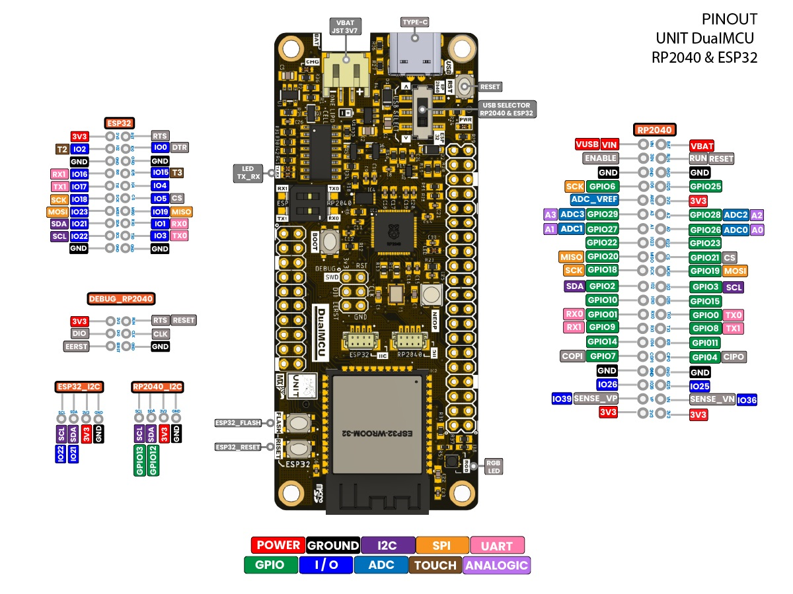

# *DualMCU*:  Administración de almacenamiento de datos en formato JSON

Este repositorio almacena datos en formato JSON utilizando la DualMCU que integran tanto el ESP32 como el RP2040. Aquí encontrarás información sobre cómo almacenar, acceder y gestionar datos en formato JSON en ambos microcontroladores.

## Contenido del Repositorio

1. [Introducción](#introducción)
2. [Configuración](#configuración)
   - [Requisitos](#requisitos)
   - [Instalación](#instalación)
3. [Almacenamiento y lectura de datos](#almacenamiento-y-lectura-de-datos)
   - [Almacenamiento de Datos](#almacenamiento-de-datos)
   - [Acceso a Datos](#acceso-a-datos)
4. [Ejemplos](#ejemplos)
5. [Contribución](#contribución)
6. [Licencia](#licencia)

## Introducción

En este repositorio, aprenderás a almacenar datos en formato JSON en la tarjeta DualMCU, que combina las capacidades de la ESP32 y el RP2040 en una sola PCB. Esto es útil para aplicaciones donde se necesita almacenar configuraciones, registros o cualquier tipo de datos estructurados.

## Configuración

### Requisitos

Antes de utilizar este repositorio, asegúrate de tener lo siguiente:

- Una tarjeta DualMCU incluye tanto un ESP32, como el RP2040.
- [Plataforma Thonny](https://thonny.org/) con soporte para la ESP32 y el RP2040.
- Cable de conexión USB a microUSB.

Configuración de tu tarjeta con Thonny:
- [Configuración del ESP32 y Micropython](https://github.com/UNIT-Electronics/DualMCU-ESP32-MicroPython)
### Instalación

1. Clona este repositorio en tu sistema:

   ```bash
    gh repo clone UNIT-Electronics/DualMCU_Manejo_de_almacenamiento

   ## Manejo de Memoria en la DualMCU con MicroPython

En esta sección, aprenderás cómo utilizar el almacenamiento de datos en la DualMCU con MicroPython para almacenar y leer datos de forma persistente.


### Almacenamiento y Lectura de Datos
JSON (JavaScript Object Notation) es un formato de datos simple y ampliamente utilizado. Se utiliza para organizar información en pares clave-valor y en listas, lo que facilita su manipulación en MicroPython y otros lenguajes de programación. En este ejemplo, exploraremos cómo utilizar JSON en MicroPython para el intercambio de datos y la configuración de dispositivos de forma eficiente.
Los codigos siguientes se encuntran en la carpeta [Software](Software/3_Read_write_json) de este repositorio.
#### Almacenamiento de datos 
```python
'''
Unit Electronics 2023
       (o_
(o_    //\
(/)_   V_/_ 

file: write_json.py
'''
import ujson as json

state = False 
jsonData = {"stateKey": state} 

try:
    with open('data.json', 'w') as f:
        json.dump(jsonData, f)
except:
        print("Error!!  No puede almacenar datos")

```
El código anterior permite la persistencia de un estado lógico de forma permanente. Para acceder al estado lógico almacenado, se sugiere emplear un código específico diseñado exclusivamente para lectura. Dado que existen diversas posibilidades de errores, a continuación, se presentan recomendaciones para gestionar posibles fallos.

#### Acceso a datos 
```python
'''
Unit Electronics 2023
       (o_
(o_    //\
(/)_   V_/_ 

file: read_json.py
'''
import ujson as json

try:
    with open('data.json', 'r') as f:
        jsonData = json.load(f)
        state = jsonData.get("stateKey")  

    print("Estado almacenado:", state)
except FileNotFoundError:
    print("El archivo 'data.json' no existe.")
except json.JSONDecodeError:
    print("Error al decodificar el archivo JSON.")
except Exception as e:
    print("Ocurrió un error inesperado:", str(e))


```
Tanto para el ESP32 como el RP2040, podrán almacenar y leer datos en formato JSON de forma permanente. Para ello, se sugiere emplear los códigos mencionados anteriormente.

Internamente en el microcontrolador encontraras el archivo data.json, el cual contiene la información almacenada. Como se muestra en la siguiente imagen:


## Ejemplos

Como primer ejemplo encontras un codigo en [Counter_test](Software/1_counter_test), el cual permite almacenar un contador en formato JSON. El contador se incrementa cada vez que se reinicia el microcontrolador. 

Lo interesante del código es que podrás visualizar el almacenamiento y lectura de datos como se muestra en la siguiente parte de código:

```python

def cargar_ultimo_valor():
    try:
        with open('data.json', 'r') as f:
            data = json.load(f)
            return data.get("stateKey", 0)
    except:
        print("Error! No se pudo cargar el último valor.")
        return 0

def guardar_ultimo_valor(valor):
    jsonData = {"stateKey": valor}
    try:
        with open('data.json', 'w') as f:
            json.dump(jsonData, f)
    except:
        print("Error! No se pudo guardar el último valor.") 

```
Para el segundo ejemplo podras encontrar el codigo [Button_state](Software/2_button_state), el cual permite almacenar el estado de un botón en formato JSON. El estado del botón se actualiza cada vez que se reinicia el microcontrolador.

Para este ejemplo se emplea la siguiente configuración de hardware para el ESP32:

```python
boton = Pin(16, Pin.IN, Pin.PULL_UP)
led = Pin(17, Pin.OUT)
```
Para el RP2040 se emplea la siguiente configuración de hardware:

```python
boton = Pin(0, Pin.IN, Pin.PULL_UP)
led = Pin(16, Pin.OUT)
```


## Contribuciones y Colaboraciones:

Agradecemos las contribuciones y colaboraciones de la comunidad para mejorar este repositorio. Si tienes ejemplos de código, documentación adicional o mejoras sugeridas, no dudes en contribuir a este proyecto.

## Licencia:

Este repositorio está bajo la Licencia Pública General de GNU versión 3.0 (GPL-3.0) para promover la colaboración abierta y el uso compartido de conocimientos

## 6. Expande tu conocimiento 

Para que continues aprendiendo, se te recomienda visitar el repositorio completo referente a la [DualMCU](https://github.com/UNIT-Electronics/DualMCU).



## 7. DualMCU ESP32+RP2040 

Para obtener más información, consulte las páginas del producto en

* https://uelectronics.com/
* [Hardware-DualMCU](https://github.com/UNIT-Electronics/DualMCU/tree/main/Hardware)
* [Product Reference Manual.pdf](https://github.com/UNIT-Electronics/DualMCU/blob/main/DualMCU(Product%20Reference%20Manual).pdf)
* [C++ & Micropython Examples files for the UNIT DualMCU.](https://github.com/UNIT-Electronics/DualMCU/tree/main/Examples)


---
⌨️ con ❤️ por [UNIT-Electronics](https://github.com/UNIT-Electronics) 😊 